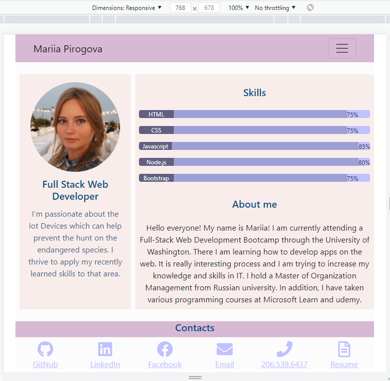

# React Portfolio

`Hello World!` 
My name is Mariia and this is my web development portfolio build using my new React skills. 

## Screenshot

## What's included

This application uses React to render content. 
It introduces 4 pages - About Me, Portfolio, Contact and Resume.

## Links to Review

* The URL of the functional, deployed application: https://maryvpie.github.io/react-portfolio

* The URL of the GitHub repository: https://github.com/MaryVPie/react-portfolio

I will be updating my portfolio on a regular basis to include my feature projects.

## Thank you for stopping by!
I am always happy to receive your [feedback! :email:](mailto:pirogova.mariia@gmail.com)

[See more my projects ](https://github.com/MaryVPie)
