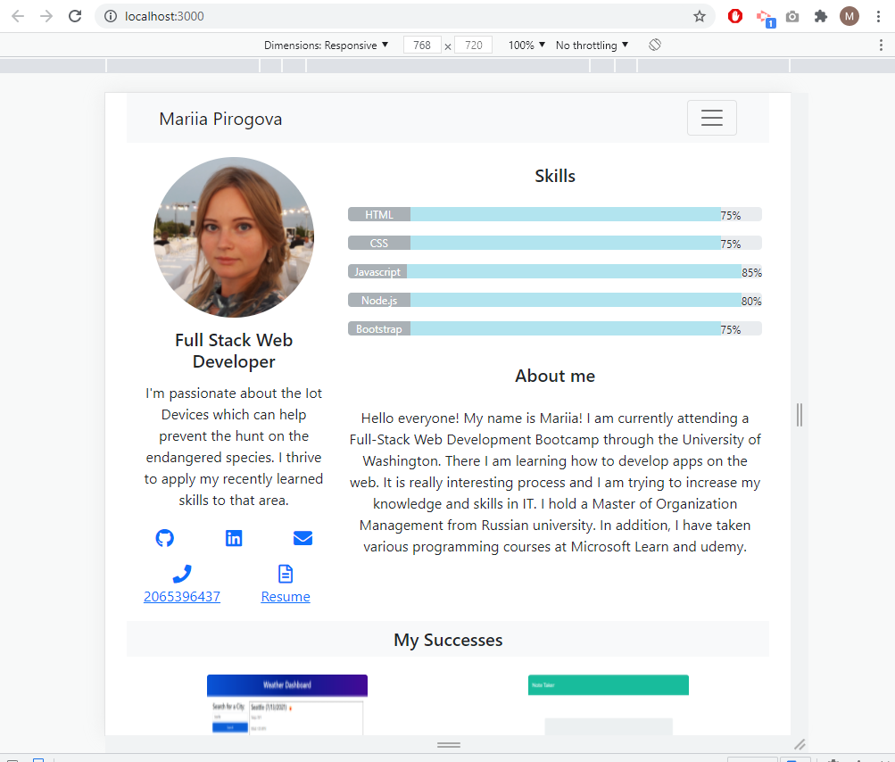

# React Portfolio

`Hello World!` 
My name is Mariia and this is my web development portfolio build using my new React skills. 

## Screenshot

## What's included

This application uses React to render content. 
There are 4 components  `Header` appears on multiple pages, `Navigation` within it that’s used to conditionally render About Me, Portfolio, Contact, and Resume sections, `Project` uses multiple times in the Portfolio section and `Footer` appears on multiple pages.

## Links to Review

* The URL of the functional, deployed application:

* The URL of the GitHub repository:

I will be updating my portfolio on a regular basis to include my feature projects.

## Thank you for stopping by!
I am always happy to receive your [feedback! :email:](mailto:pirogova.mariia@gmail.com)

[See more my projects ](https://github.com/MaryVPie)

- [x] WHEN I load the portfolio
THEN I am presented with a page containing a header, a section for content, and a footer
- [x]  WHEN I view the header
THEN I am presented with the developer's name and navigation with titles corresponding to different sections of the portfolio
- [x]  WHEN I view the navigation titles
THEN I am presented with the titles About Me, Portfolio, Contact, and Resume, and the title corresponding to the current section is highlighted
- [x]  WHEN I click on a navigation title
THEN I am presented with the corresponding section below the navigation without the page reloading and that title is highlighted
- [x]  WHEN I load the portfolio the first time
THEN the About Me title and section are selected by default
- [x] WHEN I am presented with the About Me section
THEN I see a recent photo or avatar of the developer and a short bio about them
- [x] WHEN I am presented with the Portfolio section
THEN I see titled images of six of the developer’s applications with links to both the deployed applications and the corresponding GitHub repositories
- [x] WHEN I am presented with the Contact section
THEN I see a contact form with fields for a name, an email address, and a message
- [x] WHEN I move my cursor out of one of the form fields without entering text
THEN I receive a notification that this field is required
- [x] WHEN I enter text into the email address field
THEN I receive a notification if I have entered an invalid email address
- [x] WHEN I am presented with the Resume section
THEN I see a link to a downloadable resume and a list of the developer’s proficiencies
- [x] WHEN I view the footer
THEN I am presented with text or icon links to the developer’s GitHub and LinkedIn profiles, and their profile on a third platform (Stack Overflow, Twitter)
